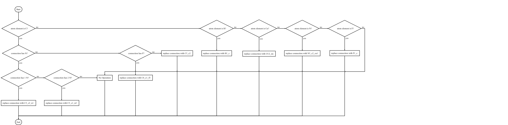

## Change

### Type Replace

### Compare

| prm | frc | note |
| :-----:   | :-----:  | :-----:  |
| `BONDS` | `#quadratic_bond` (cvff) | type:2 parameter:2 |
| `ANGLES` | `#quadratic_angle` (cvff) | type:3 parameter:2 |
| `DIHEDRALS` | `#torsion_1` (cvff) | type:4 parameter:3 |
| `IMPROPER` | `#wilson_out_of_plane` (cff91) | type:4 parameter:2 |

